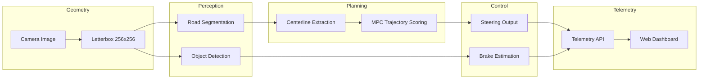

# EDGE ADAS Pipeline

Real-time monocular ADAS backend for lane keeping and collision avoidance, using a single camera stream to produce steering and braking commands.

For a detailed explanation of the system architecture, algorithms, and design decisions, see [THEORY.md](THEORY.md).

---

## 0. Architecture Overview

The system follows a structured perception → planning → control pipeline.

1. The camera frame (any resolution) is letterboxed to 256×256 for model inference.
2. Two neural networks run in parallel:
   - Road segmentation
   - Object detection
3. Outputs are mapped back to the original image space.
4. The road mask is processed to extract a centerline.
5. An MPC planner evaluates candidate trajectories using:
   - road mask
   - centerline
   - GPS bias
6. The lowest-cost trajectory determines steering.
7. Object detections influence braking decisions.
8. Control outputs and system telemetry are streamed to a web dashboard.



---

## 1. Clone the Repository

```bash
git clone https://github.com/SrabanMondal/edge-adas.git
cd edge-adas
```

---

## 2. Download Model Files

The project requires ONNX model files for **road/lane segmentation** and **object detection**.

Run the download script to automatically fetch the required models.

### Default (recommended for compatibility)

```bash
python download.py
```

This downloads:

- `yolopv2.onnx` — road and lane segmentation model  
- `yolov8n.onnx` — object detection model (lightweight, good for most systems)

### Using the newer detection model

If your GPU supports newer architectures, you can download the newer YOLO26 model instead:

```bash
python download.py --new
```

This downloads:

- `yolopv2.onnx` — road and lane segmentation model  
- `yolov26n.onnx` — newer object detection model with improved accuracy

All models are saved to:

```plain
src/weights/
```

### Model Selection Guide

| Model | Best For | Notes |
|------|------|------|
| `yolov8n.onnx` | CPU, older GPUs, Jetson devices | Lightweight and broadly compatible |
| `yolov26n.onnx` | Modern GPUs (RTX series, newer Intel/AMD iGPUs) | Higher accuracy but slightly heavier |

Both models although produce the different output format (but our code internally handles it), so they can be swapped without changing the rest of the pipeline.

---

## 3. Model Conversion

The application uses optimized inference backends and therefore expects
models in backend-specific formats.

Convert the ONNX models to one of the following formats:

- **TensorRT Engine (.engine)** → for NVIDIA GPUs
- **OpenVINO IR (.xml + .bin)** → for CPUs / Intel GPUs

> **Note**: AMD Radeon GPUs are not directly supported by TensorRT or OpenVINO. To run inference on AMD GPUs you would need a different runtime such as ROCm, ONNX Runtime with ROCm, or a custom inference backend.

---

### A. TensorRT Conversion (NVIDIA GPUs)

TensorRT engines can run in either **FP16** or **FP32** precision.

| Precision | When to use |
|----------|-------------|
| **FP16** | Recommended if your GPU supports it (RTX series, newer Jetson devices) |
| **FP32** | Use if FP16 causes issues or is unsupported |

⚠️ **Jetson Nano users:**  
In testing, **FP16 engines did not work reliably**, but **FP32 worked correctly**.  
If you are using Jetson Nano, convert using **FP32**.

---

**Convert using `trtexec`**

#### Road segmentation model

> FP16 (recommended if supported)

```bash
trtexec --onnx=src/weights/yolopv2.onnx \
        --saveEngine=src/weights/yolop/yolop.engine \
        --fp16
```

> FP32 (fallback / Jetson Nano)

```bash
trtexec --onnx=src/weights/yolopv2.onnx \
        --saveEngine=src/weights/yolop/yolop.engine \
        --fp32
```

---

#### Object detection model

> YOLOv8

```bash
trtexec --onnx=src/weights/yolov8n.onnx \
        --saveEngine=src/weights/yolo/yolo.engine \
        --fp16
```

> YOLO26

```bash
trtexec --onnx=src/weights/yolov26n.onnx \
        --saveEngine=src/weights/yolo/yolo.engine \
        --fp16
```

For **FP32**, simply remove the `--fp16` flag.

---

### Optional: Export TensorRT using YOLO CLI

If you have the **Ultralytics YOLO CLI** installed, you can export the engine directly:

```bash
pip install ultralytics
```

Then run:

```bash
yolo export model=src/weights/yolov26n.onnx \
     format=engine \
     device=0 \
     half=True
```

Move the generated engine file to:

```plain
src/weights/yolo/yolo.engine
```

---

### Expected TensorRT directory structure

```plain
src/weights/
├── yolop/
│   └── yolop.engine
└── yolo/
    └── yolo.engine
```

⚠️ **Keep these filenames unchanged** — the application expects these exact paths.

---

### B. OpenVINO Conversion (Intel CPUs / GPUs)

OpenVINO uses the **OpenVINO Model Converter  (`ovc`)** to convert ONNX models to OpenVINO IR format.

If the `ovc` command is not available, install OpenVINO first:

```bash
pip install openvino
```

After installation, the `ovc` command should be available in your environment.

---

> Convert YOLOPv2

```bash
ovc src/weights/yolopv2.onnx \
   --output_dir src/weights/yolop/ov \
   --compress_to_fp16
```

---

> YOLOv8

```bash
ovc src/weights/yolov8n.onnx \
   --output_dir src/weights/yolo/ov \
   --compress_to_fp16
```

> YOLO26

```bash
ovc src/weights/yolov26n.onnx \
   --output_dir src/weights/yolo/ov \
   --compress_to_fp16
```

---

### Expected OpenVINO directory structure

```plain
src/weights/
├── yolop/
│   └── ov/
│       ├── yolopv2.xml
│       └── yolopv2.bin
└── yolo/
    └── ov/
        ├── yolov8n.xml (or yolov26n.xml)
        └── yolov8n.bin (or yolov26n.bin)
```

---

> **Note:**  
> If the generated filenames differ from what the code expects, update the model path constants at the top of:
>
> - `src/camera_api.py`
> - `src/camera_api_cpu.py`

---

### Model Input Resolution

The original PyTorch models support **dynamic input sizes** and internally resize inputs during inference.

However, the ONNX models provided in this repository use a **fixed input resolution of 256×256**.

#### Why static input size?

This decision was made for two reasons:

1. **TensorRT compatibility**

   The development environment used **TensorRT 8.0.1**, which does not reliably support certain dynamic resize operations used by the original models.

   Exporting the models with a **static input shape** avoids these compatibility issues.

2. **Deterministic and lower-latency inference**

   By performing resizing **outside the model**, the pipeline becomes:

   - more deterministic
   - easier to optimize
   - slightly faster (no internal resize operation)

#### Camera resolution support

Even though the model expects **256×256**, the system supports **any camera resolution**.

During preprocessing, frames are:

1. **Letterboxed** (aspect ratio preserved)
2. **Resized to 256×256**
3. Passed to the inference engine

This allows the pipeline to work with cameras such as:

- 640×480
- 720p
- 1080p
- RTSP streams
- phone cameras

#### Resolution trade-off testing

We evaluated several model input resolutions:

| Input Size | Result |
|------------|--------|
| 128×128 | Very fast but noticeable accuracy drop |
| 256×256 | Best balance of speed and accuracy |
| 320×320 | Slightly better detection but higher latency |
| 480×480 | Slower with minimal improvement |
| 640×640 | Much slower for real-time use |

Based on testing, **256×256 provided the best latency vs accuracy trade-off for real-time ADAS inference**.

---

## 4. Python Dependencies

The project depends on a small set of core Python libraries.

### Core packages

| Package | Purpose |
|--------|--------|
| `numpy` | Array operations and image math |
| `opencv-python` | Camera capture and image processing |
| `fastapi` | HTTP/SSE API server |
| `uvicorn` | ASGI server used to run FastAPI |

---

#### Installation Options

#### Option 1 — Recommended (replicating this environment)

If you want to **replicate the exact development environment used for this project**, use:

- **Python 3.12**
- **uv** (modern Python package manager)

Then run:

```bash
uv sync
```

This installs the dependencies defined in `pyproject.toml` and ensures compatible versions.

---

#### Option 2 — Manual installation with pip

If your system:

- uses an **older Python version**
- runs on **older hardware (Jetson Nano, Raspberry Pi, etc.)**
- cannot easily install Python 3.12

you can install dependencies manually with `pip`.

```bash
pip install numpy opencv-python fastapi uvicorn
```

In this case, `pip` will select the **latest compatible versions for your Python version and platform**.

---

## Python Version Compatibility

This project has been **tested to run on Python 3.6 and newer**.

However:

- **Python 3.12 + uv** → recommended for reproducing the development setup
- **Python 3.6+ + pip** → works on older systems and embedded devices

---

> **Tip:**  
> If you want to match the exact versions used during development, check the dependency versions listed in `pyproject.toml`.

---

## 5. GPU Setup (Important for Beginners)

If you plan to use the **TensorRT pipeline** (`camera_api.py`), you need additional GPU-specific packages.

### Required packages

| Package | Purpose |
|---------|---------|
| `pycuda` | Python bindings for CUDA (GPU memory management) |
| `tensorrt` | NVIDIA inference runtime |
| OpenCV with CUDA | Required for GPU-accelerated image operations |

### Installation guides

These packages require careful version matching with your CUDA toolkit and GPU driver. Follow the official guides:

- **TensorRT:** [NVIDIA TensorRT Install Guide](https://docs.nvidia.com/deeplearning/tensorrt/install-guide/index.html)
- **PyCUDA:** [PyCUDA Installation](https://wiki.tiker.net/PyCuda/Installation)
- **OpenCV with CUDA:** [Build OpenCV with CUDA from source](https://docs.opencv.org/4.x/d6/d15/tutorial_building_tegra_cuda.html)

### Tips

- Install CUDA Toolkit first, then TensorRT, then PyCUDA.
- Make sure `nvcc --version` works in your terminal before installing PyCUDA.
- On Jetson devices, TensorRT and CUDA are typically pre-installed with JetPack.

### OpenVINO path (no CUDA needed)

If using the **OpenVINO pipeline** (`camera_api_cpu.py`), install the OpenVINO runtime instead:

```bash
pip install openvino
```

No CUDA or GPU driver setup is required for the OpenVINO path, though Intel GPU acceleration is available if your system supports it.

---

## 6. Testing the Setup

Before running the full application, use the test scripts in `src/test/` to validate that models load and inference works.

### Test file reference

| File | What it tests | Backend | How to run |
|------|---------------|---------|------------|
| `test_model.py` | OpenVINO engine loads and runs inference on dummy input | OpenVINO | `python -m src.test.test_model` |
| `test_model_trt.py` | TensorRT engine loads and runs inference on dummy input | TensorRT | `python -m src.test.test_model_trt` |
| `debug_engine.py` | Probes TRT engine bindings, shapes, and runs dummy inference | TensorRT | `python -m src.test.debug_engine` |
| `benchmark.py` | Benchmarks raw TRT engine latency and throughput | TensorRT | `python -m src.test.benchmark` |
| `test_infer.py` | Full OpenVINO pipeline on video (road + objects + steering) | OpenVINO | `python -m src.test.test_infer` |
| `test_trt_infer.py` | Full TensorRT pipeline on video (road + objects + steering) | TensorRT | `python -m src.test.test_trt_infer` |
| `trt_object_test.py` | TRT object detection on video with visual debug output | TensorRT | `python -m src.test.trt_object_test` |
| `trt_yolop_test.py` | TRT road segmentation on video with visual debug output | TensorRT | `python -m src.test.trt_yolop_test` |
| `test_gps.py` | GPS checkpoint logic (no models needed) | None | `python -m src.test.test_gps` |
| `test_video.py` | Video checker and put the converted video to src/data for testing | None | `python -m src.test.test_video` |

### Recommended validation order

1. **Run `test_model.py`** (OpenVINO) or **`debug_engine.py`** (TensorRT) — confirms model files load correctly.
2. **Run `test_video.py`** to create the clean video ready to be used for testing and debugging
3. **Run `test_infer.py`** or **`test_trt_infer.py`** — confirms the full pipeline works end-to-end.

### Important notes for test scripts

- Video-based tests (`test_infer.py`, `test_trt_infer.py`, etc.) expect a video file at `src/data/input.mp4`. You need to provide your own test video.
- Model paths are hardcoded at the top of each test file. If your converted model filenames differ, edit the path constants before running.
- Use the `--demo` flag with `test_infer.py` / `test_trt_infer.py` to generate a visual debug video:

```bash
  python -m src.test.test_infer --demo
```

---

## 7. Running the Application

Once all tests pass, start the camera pipeline.

### TensorRT pipeline (NVIDIA GPU)

Use this if your system has an **NVIDIA GPU** and you built the **TensorRT engine**.

```bash
python -m src.camera_api
```

### OpenVINO pipeline (CPU / Intel GPU)

Use this if you are running on **CPU** or **Intel GPU** with the OpenVINO runtime.

```bash
python -m src.camera_api_cpu
```

Both pipelines start the camera stream and launch the telemetry server.

---

### Optional: GPS Integration

The MPC controller already supports GPS-based bias correction.
If your device has GPS access, you can stream GPS coordinates into the frame processing pipeline.

Steps:

1. Implement GPS reading inside the frame processing logic.
2. Follow the example in `test_gps.py`.
3. Insert the GPS update checkpoints inside:

   - `camera_api.py`
   - `camera_api_cpu.py`
4. Pass the returned `gps_bias` value to the MPC controller.

The `test_gps.py` script demonstrates how the checkpoint system works and how GPS bias is calculated while moving along a route.

---

### Configuration

Set the camera source using the `CAMERA_IP` environment variable.

The application supports:

- **Local webcams**
- **RTSP network cameras**
- **HTTP video streams (e.g., phone camera apps)**

---

#### Linux / macOS (bash, zsh)

```bash
# Use default webcam (index 0)
export CAMERA_IP=0

# Use an IP camera stream
export CAMERA_IP=rtsp://192.168.1.100:554/stream
```

---

#### Windows — PowerShell

```powershell
# Use default webcam
$env:CAMERA_IP=0

# Use an IP camera stream
$env:CAMERA_IP="rtsp://192.168.1.100:554/stream"
```

---

#### Windows — Command Prompt (cmd)

```cmd
set CAMERA_IP=0
```

```cmd
set CAMERA_IP=rtsp://192.168.1.100:554/stream
```

---

#### Testing with a Phone Camera (Optional)

If you don't have an IP camera, you can test using your phone.

1. Install an **IP Webcam app** on your phone.
2. Connect your phone and computer to the **same Wi-Fi network**.
3. Start the server inside the app.

The app will provide a stream URL similar to:

```url
http://PHONE_IP:8080/video
```

Example:

```bash
export CAMERA_IP=http://192.168.1.45:8080/video
```

This will stream your **phone camera feed directly into the application**.

---

#### Examples

Local webcam:

```env
CAMERA_IP=0
```

RTSP camera:

```env
CAMERA_IP=rtsp://192.168.1.100:554/stream
```

Phone camera:

```env
CAMERA_IP=http://192.168.1.45:8080/video
```

After setting the variable, start the application normally.

### Web Interface and API Endpoints

Once the server starts, open the dashboard in your browser:

```
http://localhost:8000
```

This interface provides a **live telemetry dashboard**, including:

- brake force
- steering angle
- inference latency
- FPS (frames per second)

---

### Accessing the dashboard from another device

You can also view the interface from another device (phone, tablet, laptop).

Requirements:

1. Both devices must be connected to the **same Wi-Fi network**.
2. Find the **local IP address** of the machine running this application.
3. Replace `localhost` with that IP.

Example:

```url
http://192.168.1.25:8000
```

The IP address is usually shown when the server starts, or you can find it with:

> **Linux / macOS**

```bash
ip a
```

> **Windows**

```bash
ipconfig
```

---

### Available API Endpoints

| Endpoint | Description |
|----------|-------------|
| `http://localhost:8000/` | Web dashboard with live telemetry and camera preview |
| `http://localhost:8000/api/telemetry` | Latest telemetry snapshot (JSON) |
| `http://localhost:8000/api/telemetry/stream` | Real-time telemetry stream (Server-Sent Events) |

These endpoints can be used for **external dashboards, logging systems, or robotics integrations**.

---

## Performance Benchmarks

The system was tested on two representative hardware environments.

### 1. Laptop (OpenVINO pipeline)

Hardware:

- Intel i5 CPU
- Intel Iris Xe integrated GPU
- 16 GB RAM
- Windows

Backend:

- OpenVINO

Performance:

- **24–26 FPS**
- **No frame skipping**
- Real-time processing with full pipeline enabled.

---

### 2. Jetson Nano (TensorRT pipeline)

Hardware:

- NVIDIA Jetson Nano
- 4 GB RAM
- 128-core Maxwell GPU

Software environment:

- JetPack **4.6.1**
- TensorRT **8.0.1**
- CUDA **10.2**
- cuDNN **8.2.1**

Performance:

- **23–25 FPS effective throughput**
- **Every 3rd frame processed**

Frame skipping is used on the Nano to maintain stable real-time performance under limited GPU resources.

These results demonstrate that the pipeline can run in **real-time on both embedded edge devices and standard laptops**.

---

## License

MIT License

## Acknowledgments

- [YOLOPv2](https://github.com/CAIC-AD/YOLOPv2) — Panoptic driving perception
- [OpenVINO](https://docs.openvino.ai/) — Intel inference toolkit
- [TensorRT](https://developer.nvidia.com/tensorrt) — NVIDIA inference optimizer
